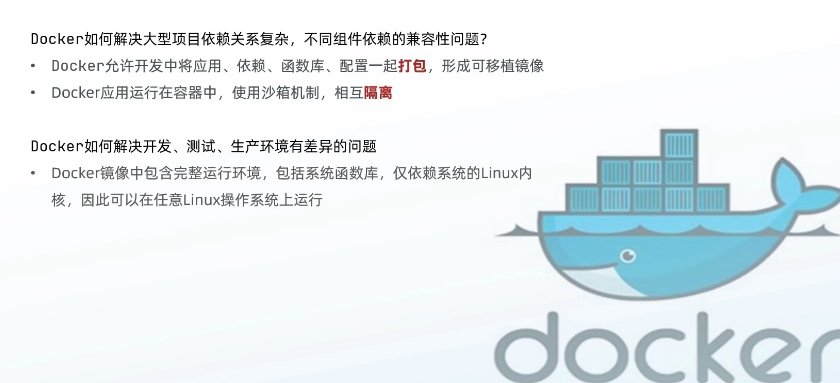
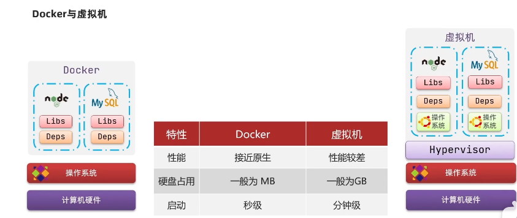
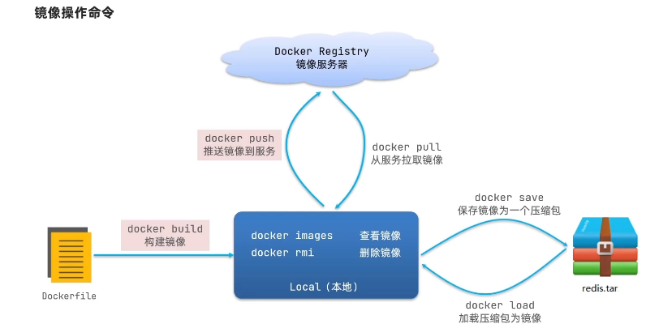

## 一. 初识Docker

Docker是一个快速交付应用, 运行应用的技术:
1. 可以将程序机器依赖, 运行环境一起打包为一个镜像, 可以迁移到任意linux操作系统
2. 运行是利用沙箱机制形成隔离容器, 各个应用互不干扰
3. 启动, 移除都可以通过一行命令完成, 方便快捷

## 二. Docker与虚拟机

Docker和虚拟机的差异
- docker是一个系统进程; 虚拟机是在操作系统中的操作系统
- docker体积小, 启动速度快, 性能好; 虚拟机体积大, 启动速度慢, 性能一般

## 三. 镜像和容器
- 镜像(Image): Docker将应用程序及其所需的依赖, 函数库, 环境, 配置等文件打包在一起, 称为镜像
- 容器(Container): 镜像中的应用程序运行后形成的进程就是容器, 只是Docker会给容器做隔离, 对外不可见
- DockerHub: DockerHub是一个Docker镜像的托管平台, 这样的平台称之为Docker Registry

Docker是一个
CS架构的程序, 由两部分组成:
- 服务端(server): Docker守护进程, 负责处理Docker指令, 管理镜像, 容器等
- 客户端(client): 通过命令或RestAPI想Docker服务端发送命令, 可以在本地或远程向服务端发送指令

## 三. Docker基本操作
### (1). 镜像相关命令
- 镜像名称一般分为两部分组成: [repository]:[tag]
- 没有制定tag时, 默认是latest, 代表是最新版本的镜像

Docker操作命令
- docker build(构建镜像)
- docker pull(从服务拉去镜像)
- docker images(查看镜像)
- docker rmi(删除镜像)
- docker push(推送镜像到服务)
- docker save(保存镜像为一个压缩包)
- docker load(加载压缩包为镜像)

### (2). 创建容器
- docker run(创建容器, 并运行)
- docker unpause/pause(暂停容器)
- docker stop(停止容器)
- docker start(开始容器)
- docker logs(查看容器运行日志)
- docker ps(查看所有运行的容器及状态)

### (3). 创建运行一个Nginx容器
`docker run --name containerName -p 80:80 -d nginx`

命令解读:
- docker run: 创建并运行一个容器
- --name: 给容器起一个名字, 比如叫做mn
- -p: 将宿主机端口与容器端口映射, 冒号左侧是宿主机端口, 右侧是容器端口
- -d: 后台运行容器
- docker logs: 查看容器日志
- 添加-f参数可以持续查看日志
- docker ps: 查看容器状态