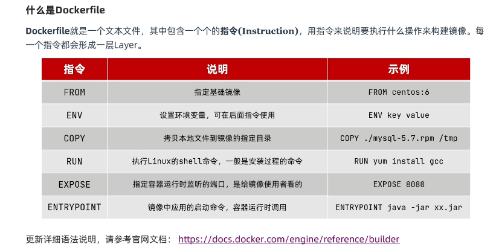
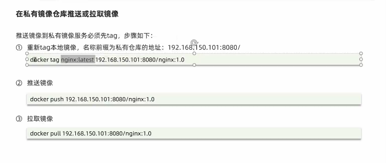

## 一. 初识Docker


Docker是一个快速交付应用, 运行应用的技术:
1. 可以将程序机器依赖, 运行环境一起打包为一个镜像, 可以迁移到任意linux操作系统
2. 运行是利用沙箱机制形成隔离容器, 各个应用互不干扰
3. 启动, 移除都可以通过一行命令完成, 方便快捷

## 二. Docker与虚拟机


Docker和虚拟机的差异
- docker是一个系统进程; 虚拟机是在操作系统中的操作系统
- docker体积小, 启动速度快, 性能好; 虚拟机体积大, 启动速度慢, 性能一般

## 三. 镜像和容器
- 镜像(Image): Docker将应用程序及其所需的依赖, 函数库, 环境, 配置等文件打包在一起, 称为镜像
- 容器(Container): 镜像中的应用程序运行后形成的进程就是容器, 只是Docker会给容器做隔离, 对外不可见
- DockerHub: DockerHub是一个Docker镜像的托管平台, 这样的平台称之为Docker Registry

Docker是一个
CS架构的程序, 由两部分组成:
- 服务端(server): Docker守护进程, 负责处理Docker指令, 管理镜像, 容器等
- 客户端(client): 通过命令或RestAPI想Docker服务端发送命令, 可以在本地或远程向服务端发送指令

## 三. Docker基本操作
### (1). 镜像相关命令
- 镜像名称一般分为两部分组成: [repository]:[tag]
- 没有制定tag时, 默认是latest, 代表是最新版本的镜像

Docker操作命令
- docker build(构建镜像)
- docker pull(从服务拉去镜像)
- docker images(查看镜像)
- docker rmi(删除镜像)
- docker push(推送镜像到服务)
- docker save(保存镜像为一个压缩包)
- docker load(加载压缩包为镜像)


### (2). 创建容器
- docker run(创建容器, 并运行)
- docker unpause/pause(暂停容器)
- docker stop(停止容器)及状态)

### (3). 创建运行一个Nginx容器
`docker run --name containerName -p 80:80 -d nginx`

命令解读:
- docker run: 创建并运行一个容器
- docker start(开始容器)
- docker logs(查看容器运行日志)
- docker ps(查看所有运行的容器
- --name: 给容器起一个名字, 比如叫做mn
- -p: 将宿主机端口与容器端口映射, 冒号左侧是宿主机端口, 右侧是容器端口
- -d: 后台运行容器
- docker logs: 查看容器日志
- 添加-f参数可以持续查看日志
- docker ps: 查看容器状态

### (4). 进入容器内部修改文件
`docker exec -it mn bash`
- docker exec: 进入容器内部, 执行一个内容
- -it: 给当前进入的容器创建一个标准的输入, 输出终端, 允许我们与容器交互
- mn: 进入的容器的名称
- bash: 进入容器后执行的命令, bash是一个linux终端交互命令
- docker rm -f 强制删除运行中的容器

exec命令可以进入容器修改文件, 但是在容器内修改文件是不推荐的

### (5). 创建并运行一个redis容器, 并且支持数据持久化
- 步骤一: 到DockerHub搜索Redis镜像
- 步骤二: 查看Redis镜像文档中的帮助信息
- 步骤三: 利用docker run命令运行一个Redis容器
`docker run --name redis -p 6379:6379 -d redis redis-server --appendonly yes`

### (6). 数据卷
- 容器与数据耦合的问题:
  - 不便于修改: 当我们要修改Nginx的html内容时, 需要进入容器内部修改, 很不方便
  - 数据不可复用: 在容器内的修改对外是不可见的. 所有修改对新创建的容器是不可复用的
  - 升级维护困难: 数据在容器内, 如果要升级容器必然删除容器, 所有数据都跟着删除了

- 数据卷: 是一个虚拟目录, 指向宿主机文件系统中的某个目录
  - 操作的基本语法: 
  - docker volume[COMMAND] 该命令根据跟随的command来确定下一步的操作
    - create 创建一个volume
    - inspect 显示一个或多个volume的信息
    - ls 列出所有的volume
    - prune 删除未使用的volume
    - rm 删除一个或多个指定的volume
- 数据卷的作用: 将容器与数据分离, 解耦合, 方便操作容器内部数据, 保证数据安全

- 挂载数据卷
  - 我们在创建容器时, 可以通过 -v参数来挂载一个数据卷到某个容器目录
  - docker run \
  - --name mn \
  - -v redis:/home/redis \
  - -p 8080:80
  - nginx \
  
- -v volumeName:/targetContainerPath
- 如果容器运行时volume不存在, 会自动被创建出来
- 数据卷与目录直接挂载的
  - 数据卷挂载耦合度低, 有docker来管理目录, 但是目录较深, 不好找
  - 目录挂载耦合度高, 需要我们自己管理目录, 不过目录容易寻找查看
## 四. Dockerfile自定义容器
### (1). 镜像结构: 
- 镜像是将应用程序及其需要的系统函数库, 环境, 配置, 依赖打包而成
- 镜像结构(镜像是分层结构, 每一个层称为一个Layer):
  - 入口(Entrypoint): 镜像运行入口, 一般是程序启动的脚本和参数
  - 层(Layer): 在BaseImage基础上添加安装包, 依赖, 配置等, 每次操作都形成新的一层
  - 基础镜像(BaseImage): 应用依赖的系统函数库, 环境, 配置, 文件等 
  - 其他: 在BaseImage基础上添加依赖, 安装程序, 完成整个应用的安装和配置

### (2). 什么是Dockerfile


安装命令: . 是告诉docker Dockerfile在当前目录

Dockerfile
```
# 指定基础镜像
FROM ubuntu:16.04
# 配置环境变量，JDK的安装目录
ENV JAVA_DIR=/usr/local

# 拷贝jdk和java项目的包
COPY ./jdk8.tar.gz $JAVA_DIR/
COPY ./docker-demo.jar /tmp/app.jar

# 安装JDK
RUN cd $JAVA_DIR \
 && tar -xf ./jdk8.tar.gz \
 && mv ./jdk1.8.0_144 ./java8

# 配置环境变量
ENV JAVA_HOME=$JAVA_DIR/java8
ENV PATH=$PATH:$JAVA_HOME/bin

# 暴露端口
EXPOSE 8090
# 入口，java项目的启动命令
ENTRYPOINT java -jar /tmp/app.jar
```

```
docker build -t javaweb:1.0 . 
```

简易版本[Dockerfile](resources/Dockerfile)
```
# 指定基础镜像
FROM openjdk:8-alpine

COPY ./docker-demo.jar /tmp/app.jar

# 暴露端口
EXPOSE 8090
# 入口，java项目的启动命令
ENTRYPOINT java -jar /tmp/app.jar
```


- Dockerfile本质是一个文件, 通过指令描述镜像的构建过程
- Dockerfile的第一行必须是FROM, 从一个基础镜像来构建
- 基础镜像可以是基本操作系统, 如Ubuntu. 也可以是其他人制作好的镜像, 例如: java:8-alpine

## 五. DOckerCompose
### (1). 初始DockerCompose
- 可以基于Compose文件帮我们快速的部署分布式应用, 而无序手动一个个创建和运行容器
- Compose文件是一个文本文件, 通过指令定义集群中的每个容器如何运行

### (2). 部署微服务集群
将之前所写的cloud-demo微服务部署到docker集群上去, 命令如下, 需要使用DockerCompose组件
```
docker-compose up -d
```

## 六. Docker镜像仓库
- 搭建私有镜像仓库
  - 可以在本地搭建私有Docker Registry
  - 
- 向镜像仓库推送镜像
- 从镜像仓库拉去镜像
  
