<!-- TOC -->
  * [一.认识微服务](#一认识微服务)
    * [1. 分布式架构: 根据业务功能对系统进行拆分, 每个业务模块作为独立项目开发, 称为一个服务](#1-分布式架构-根据业务功能对系统进行拆分-每个业务模块作为独立项目开发-称为一个服务)
    * [2. 微服务结构: SpringCloud 和 阿里巴巴的Dubbo](#2-微服务结构-springcloud-和-阿里巴巴的dubbo)
  * [二. 服务拆分及远程调用](#二-服务拆分及远程调用)
    * [1. 服务拆分注意事项](#1-服务拆分注意事项)
    * [2. 案例: 订单服务,根据订单id查询订单功能 模块拆分](#2-案例-订单服务根据订单id查询订单功能-模块拆分)
    * [3. 服务提供者和服务消费者](#3-服务提供者和服务消费者)
  * [三. Eureka注册中心](#三-eureka注册中心)
    * [1. eurekaServer和eurekaClient](#1-eurekaserver和eurekaclient)
    * [2. eureka的作用](#2-eureka的作用)
  * [四. 搭建和使用 Eureka](#四-搭建和使用-eureka)
    * [(1). 引依赖](#1-引依赖)
    * [(2). 配置主程序启动类](#2-配置主程序启动类)
    * [(3). 写入配置文件application.yaml](#3-写入配置文件applicationyaml)
    * [(4). 在order-service完成服务拉取](#4-在order-service完成服务拉取)
  * [四. Ribbon负载均衡](#四-ribbon负载均衡)
  * [五. Nacos注册中心](#五-nacos注册中心)
    * [1. Nacos安装和配置](#1-nacos安装和配置)
    * [2. Nacos服务分级存储模型](#2-nacos服务分级存储模型)
      * [(1). 服务跨集群调用问题](#1-服务跨集群调用问题)
      * [(2). 实现优先访问本地集群](#2-实现优先访问本地集群)
      * [(3). 根据权重负载均衡](#3-根据权重负载均衡)
      * [(4). 环境隔离-namespace](#4-环境隔离-namespace)
    * [3. Nacos注册中心原理](#3-nacos注册中心原理)
      * [(1). 临时实例和非临时实例](#1-临时实例和非临时实例)
      * [(2). Nacos与Eureka的共同点](#2-nacos与eureka的共同点)
      * [(3). Nacos与Eureka的区别](#3-nacos与eureka的区别)
  * [六. Nacos配置管理](#六-nacos配置管理)
    * [1. 统一配置管理](#1-统一配置管理)
    * [(1). 引入Nacos的配置管理客户端依赖](#1-引入nacos的配置管理客户端依赖)
    * [(2). 配置bootstrap.yaml配置文件](#2-配置bootstrapyaml配置文件)
    * [(3). 将配置交给nacos管理的步骤](#3-将配置交给nacos管理的步骤)
    * [2. 配置热更新](#2-配置热更新)
      * [(1). 配置自动刷新](#1-配置自动刷新)
    * [3. 配置共享](#3-配置共享)
      * [(1). 多环境配置共享](#1-多环境配置共享)
    * [4. 搭建Nacos集群](#4-搭建nacos集群)
  * [七. Feign远程调用](#七-feign远程调用)
    * [1. Feign替代RestTemplate](#1-feign替代resttemplate)
    * [2. 自定义配置](#2-自定义配置)
    * [3. Feign使用优化](#3-feign使用优化)
    * [4. 最佳实践](#4-最佳实践)
      * [(1). 方式一(继承):](#1-方式一继承-)
    * [(2). 方式二(抽取):](#2-方式二抽取-)
  * [八. GateWay网关组件](#八-gateway网关组件)
<!-- TOC -->

## 一.认识微服务

### 1. 分布式架构: 根据业务功能对系统进行拆分, 每个业务模块作为独立项目开发, 称为一个服务

- 优点:
    1. 降低服务耦合
    2. 有利于服务升级扩展

- 微服务是一种经过良好架构设计的分布式架构方案, 微服务架构特征:
    1. 单一自责: 微服务拆分粒更小, 每一个服务都对应唯一的业务能力, 做到单一职责, 避免重复业务开发
    2. 面向服务: 微服务对外暴露业务接口
    3. 自治: 团队独立, 技术独立, 数据独立, 部署独立
    4. 隔离性强: 服务调用做好隔离, 容错, 降级, 避免出现级联问题

`为了实现高内聚低耦合`

### 2. 微服务结构: SpringCloud 和 阿里巴巴的Dubbo

- 微服务技术对比:
    - springCloud -----------------------------------------------SpringCloudAlibaba
    - 注册中心:    Eureka, Consul-------------------------------Nacos, Eureka
    - 服务远程调用:   Feign(http协议)-------------------------Dubbo, Feign
    - 配置中心:       SpringCloudConfig--------------------------SpringCloudConfig, Nacos
    - 服务网关:       SpringCloudGateway, Zuul----------------SpringCloudGateway, Zuul
    - 服务监控和保护: Hystrix----------------------------------Sentinel

`SpringCloud集成了各种微服务功能组件, 并基于SpringBoot实现了
这些组件的自动装配, 从而提供了良好的开发环境`

## 二. 服务拆分及远程调用

### 1. 服务拆分注意事项

1. 不同微服务, 不要重复来发相同业务
2. 微服务数据独立, 不要访问其他微服务的数据库
3. 微服务可以讲自己的业务暴露为接口, 供其他微服务调用

### 2. 案例: 订单服务,根据订单id查询订单功能 模块拆分

`需求: 根据订单id查询订单的同时, 把订单所属的用户信息一起返回`

- 在订单服务中远程调用用户服务:
  `在服务层中进行基于RestTemplate发起的http请求实现远程调用`

```java

@Service
public class OrderService {

    @Autowired
    private OrderMapper orderMapper;

    @Autowired
    private RestTemplate restTemplate;

    public Order queryOrderById(Long orderId) {
        /*1.查询订单*/
        Order order = orderMapper.findById(orderId);
        /*利用RestTemplate发起http请求, 查询用户*/
        /*url路径*/
        String url = "http://localhost:8081/user/" + order.getUserId();
        /* 4.返回*/
        User user = restTemplate.getForObject(url, User.class);
        order.setUser(user);
        return order;
    }
}
```

发起请求返回的结果为:

```json
{
  "id": 108,
  "price": 31900,
  "name": "梵班（FAMDBANN）休闲男鞋",
  "num": 1,
  "userId": 3,
  "user": {
    "id": 3,
    "username": "华沉鱼",
    "address": "湖北省十堰市"
  }
}
```

- http请求做远程调用是与语言无关的调用, 只要知道对方的ip, 端口, 接口路径, 请求参数即可

### 3. 服务提供者和服务消费者

- 服务提供者: 一次业务中, 被其它微服务调用的服务(提供接口给其他微服务)
- 服务消费者: 一次业务中, 调用其它微服务的服务(调用其它微服务提供的接口)
- 提供者和消费者是相对的

服务A调用服务B, 调用服务B调用服务C, 那么服务B是什么角色?

- 相对于服务A是提供者
- 相对于服务C是消费者

## 三. Eureka注册中心

### 1. eurekaServer和eurekaClient

- eurekaServer服务端和注册中心, 管理远程调用
- eurekaClient客户端, 每一个微服务

1. 每一个微服务都向eureka-server注册服务信息: 如服务器的端口和ip等配置信息
2. 每一个微服务都可以通过eureka拉取对应服务的注册信息
3. 通过负载均衡选取ip和端口
4. 远程调用

### 2. eureka的作用

- 消费者如何获取服务提供者具体信息?
    - 服务提供者启动时向eureka注册自己的信息
    - eureka保存这些信息
    - 消费者根据服务名称向eureka拉去提供者信息
- 如果有多个服务提供者, 消费者该如何选择?
    - 服务消费者利用负载均衡算法, 从服务列表中挑选一个
- 消费者如何感知服务这提供健康状态?
    - 服务提供者会每隔30秒向EurekaServer发送心跳请求, 报告健康状态
    - eureka会更新记录服务列表信息, 心跳不正常会被剔除
    - 消费者就可以拉取到最新的信息

## 四. 搭建和使用 Eureka

### (1). 引依赖

```xml

<dependencies>
    <dependency>
        <!--eureka服务器-->
        <groupId>org.springframework.cloud</groupId>
        <artifactId>spring-cloud-starter-netflix-eureka-server</artifactId>
    </dependency>
</dependencies>
```

### (2). 配置主程序启动类

```java

@EnableEurekaServer
@SpringBootApplication
public class EurekaApplication {
    public static void main(String[] args) {
        SpringApplication.run(EurekaApplication.class, args);
    }
}
```

### (3). 写入配置文件application.yaml

服务端:

```yaml
server:
  port: 10086
spring:
  application:
    name: eurekaserver #服务名称
eureka:
  client:
    service-url:
      defaultZone: http://127.0.0.1:10086/eureka  #服务注册信息
```

客服端:

```yaml
server:
  port: 8081
spring:
  datasource:
    url: jdbc:mysql://localhost:3306/sql_store?useSSL=false
    username: root
    password: root
    driver-class-name: com.mysql.jdbc.Driver
  application:
    name: userserver #user服务名称
mybatis:
  type-aliases-package: cn.itcast.user.pojo
  configuration:
    map-underscore-to-camel-case: true
logging:
  level:
    cn.itcast: debug
  pattern:
    dateformat: MM-dd HH:mm:ss:SSS
eureka:
  client:
    service-url:
      defaultZone: http://127.0.0.1:10086/eureka
```

### (4). 在order-service完成服务拉取

服务拉取是基于服务名称获取服务列表, 然后在对服务列表做负载均衡

1. 修改OrderService的代码, 用服务吗代替ip端口

```
String url = "http://userservice/user/" + order.getUserId();
```

2. 在order-service项目的启动类orderApplication中的RestTemplate添加负载均衡注解:

   负载均衡--->`LoadBalance`

```java

@MapperScan("cn.itcast.order.mapper")
@SpringBootApplication
public class OrderApplication {

    public static void main(String[] args) {
        SpringApplication.run(OrderApplication.class, args);
    }

    /**
     * Description: 创建restTemplate并注入spring容器
     * @return org.springframework.web.client.RestTemplate
     * @author huian
     * @Date 2023/8/7
     * */
    @Bean
    @LoadBalanced
    public RestTemplate restTemplate() {
        return new RestTemplate();
    }

}
```

## 四. Ribbon负载均衡

拦截请求解析service找到真正的地址

Ribbon的负载均衡规则是一个叫做IRule的接口来定义的, 每一个子接口都是一种规则:
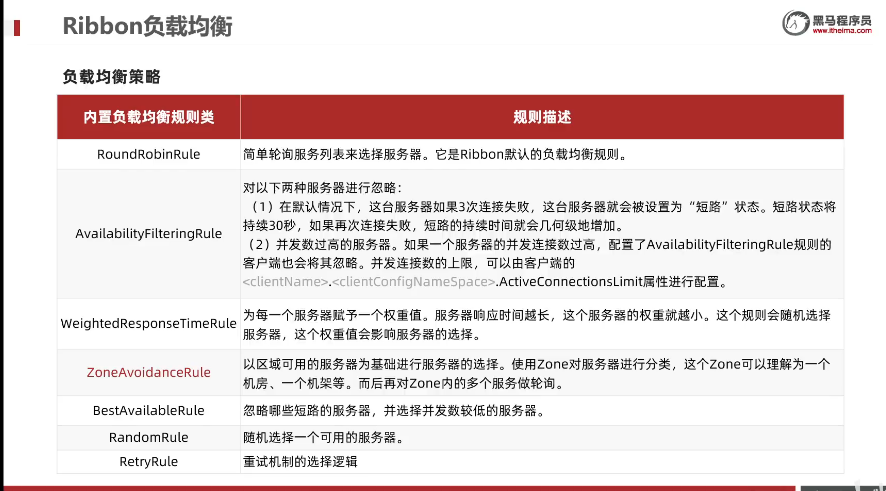

通过`定义IRule`实现可以修改负载均衡规则, 有两种方式:

1. 代码方式: 在order-service中的OrderApplication类中, 定义一个新的Rule, 作用于全局:
   ```java
   @MapperScan("cn.itcast.order.mapper")
   @SpringBootApplication
   public class OrderApplication {
   
     public static void main(String[] args) {
       SpringApplication.run(OrderApplication.class, args);
     }
       /**
        * Description: randomRule负载均衡策略中的随机数策略
        * @return com.netflix.loadbalancer.IRule
        * @author huian
        * @Date 2023/8/8
        * */
       @Bean
       public IRule randomRule(){
           return new RandomRule();
       }
   }
   ```
2. 配置文件的方式: 在order-service的application.yaml文件中, 添加新的配置也可以修改规则,
    ```yaml
   userservice:
      ribbon:
          NFLoadBalancerRuleClassName: com.netflix.loadbalancer.RandomRule # 负载均衡规则
    ```
3. Ribbon默认采用懒加载, 即第一次访问时才会去创建LoadBalanceClient, 请求时间会很长, 而饥饿加载则会在项目创建时,
   降低第一次访问的耗时,
   通过以下配置开启饥饿加载:
     ```yaml
     ribbon:
        eager-load:
            enabled: true # 开启饥饿加载
            clients:
                - userservice # 指定饥饿加载的服务名称
    ```

## 五. Nacos注册中心

### 1. Nacos安装和配置

Nacos是阿里巴巴产品, 现在是Spring的一个组件之一, 相比Eureka功能更加丰富

[Nacos安装和配置](resources/Nacos安装指南.md)

Nacos依赖配置:

父类工程

```xml
 <!--nacos管理依赖-->
<dependency>
    <groupId>com.alibaba.cloud</groupId>
    <artifactId>spring-cloud-alibaba-dependencies</artifactId>
    <version>2.2.6.RELEASE</version>
    <type>pom</type>
    <scope>import</scope>
</dependency>
```

子类工程

```xml
<!--nacos依赖-->
<dependency>
    <groupId>com.alibaba.cloud</groupId>
    <artifactId>spring-cloud-starter-alibaba-nacos-discovery</artifactId>
</dependency>
```

yaml文件配置:

```yaml
spring:
  cloud:
    nacos:
      discovery:
        server-addr: localhost:8848 # nacos服务地址
```

### 2. Nacos服务分级存储模型

#### (1). 服务跨集群调用问题

```
服务调用尽可能选择本地集群的服务, 跨集群调用延迟较高,
本地集群不可访问时, 再去访问其他集群
```

- Nacos服务分级存储模型
    - 一级是服务, 例如userservice
    - 二级是集群, 例如杭州或上海
    - 三级是实例, 例如杭州机房的某台部署了userservice的服务器
- 如何设置实例的集群属性
  ```yaml
  cloud:
    nacos:
      discovery:
        cluster-name: SH  # 集群名称, 这里代表上海
  ```

#### (2). 实现优先访问本地集群

- 在order-service中设置负载均衡的IRule为NacosRule, 这个规则会优先寻找与自己同集群的服务:

```yaml
userservice:
  ribbon:
    NFLoadBalancerRuleClassName: com.alibaba.cloud.nacos.ribbon.NacosRule  # NacosRule负载均衡规则
```

NacosRule是优先访问本地集群的策略, 但是在本地集群的轮询机制是随机的, 本地集群服务没有, 会访问其他地域的集群服务, 同时发出警告

- 注意将user-service权重置为1

#### (3). 根据权重负载均衡

- 服务器设备性能各有差异, 部分实例所在机器性能较好, 另一些较差, 我们希望性能好的机器承担更多的用户请求
- Nacos提供了权重配置来控制访问频率, 权重越大则访问频率越高
- Nacos控制台可以设置实例的权重值, 在集群的编辑按钮里可以设置权重
- 权重为0时不会再访问该服务, 此时可以进行服务器升级配置, 再升级后可以将权重提高一点, 让少量用户进行访问测试, 而用户没有感知,
  达到一种平滑升级的效果

#### (4). 环境隔离-namespace

Nacos中服务存储和数据存储的最外层都是一个名为namespace的佛那个系, 用来做最外层隔离

- namespace用来做环境隔离
- 每个namespace都有唯一id
- 不同namespace下的服务不可见

配置自命名namespace

```yaml
  cloud:
    nacos:
      discovery:
        cluster-name: SH  # 集群名称, 这里代表上海
        namespace: uuid # 自己创建的命名空间的uuid
```

### 3. Nacos注册中心原理

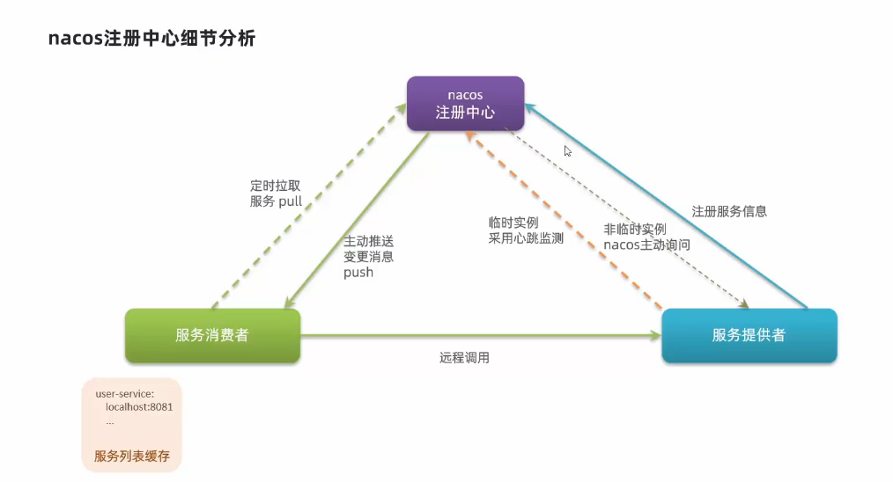

#### (1). 临时实例和非临时实例

服务注册到Nacos时, 可以选择注册为临时或非临时实例, 通过下面的配置来设置

```yaml
spring:
  cloud:
    nacos:
      discovery:
        ephemeral: false #设置为非临时实例
```

#### (2). Nacos与Eureka的共同点

- 都支持服务注册和服务拉取
- 都支持服务提供者心跳方式做健康检测

#### (3). Nacos与Eureka的区别

- Nacos支持服务端主动检测提供者状态: 临时实例采用心跳模式, 非临时实例采用主动检测模式
- 临时实例心跳不正常会被剔除, 非临时实例则不会被剔除
- Nacos支持服务列表变更的消息推送模式, 服务列表更新更及时
- Nacos集群`默认采用AP方式`, 当集群中存在非临时实例时, `采用CP模式`; Eureka`采用AP方式`

## 六. Nacos配置管理

### 1. 统一配置管理

- 配置更改热更新 - 将配置管理服务变更的配置和本地服务的配置进行结合, 同时自动更新不需要重启服务
- Nacos配置管理服务(读取配置), Nacos注册中心(注册发现)

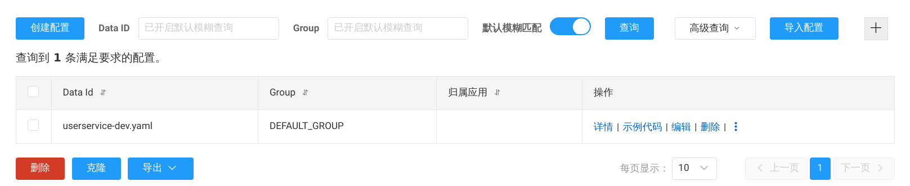

- 配置获取的步骤如下: 项目启动--->读取Nacos中的配置文件--->读取本地配置文件application.yml--->创建spring容器--->加载bean
- 首先需要配置bootstrap.yaml配置文件, 这个文件的优先级高于application.yaml, 与Nacos的所有相关配置都写在这里

### (1). 引入Nacos的配置管理客户端依赖

```xml
<!--nacos配置管理依赖-->
<dependency>
    <groupId>com.alibaba.cloud</groupId>
    <artifactId>spring-cloud-starter-alibaba-nacos-config</artifactId>
</dependency>
```

### (2). 配置bootstrap.yaml配置文件

```yaml
spring:
  application:
    name: userservice
  profiles:
    active: dev # 开发地址
  cloud:
    nacos:
      discovery:
        cluster-name: SH  # 集群名称, 这里代表杭州
        namespace: uuid
      server-addr: localhost:8848  # nacos地址
      config:
        file-extension: yaml # 文件后缀名
```

### (3). 将配置交给nacos管理的步骤

- 在Nacos中添加配置文件
- 在微服务中引入nacos的config依赖
- 在微服务中添加bootstrap.yml, 配置nacos地址, 当前环境, 服务名称, 文件后缀名. 这些决定了程序启动时去nacos读取那个文件

### 2. 配置热更新

#### (1). 配置自动刷新

Nacos中的配置文件变更后, 微服务无需重启就可以感知, 不过需要通过下面两种配置实现:

- 方式一: 在@Value注入的变量所在类上添加注解@RefreshScope

```java

@Slf4j
@RestController
@RequestMapping("/user")
@RefreshScope
public class UserController {

}
```

- 方式二: 使用@ConfigurationProperties注解

直接创建一个bean来动态获取配置

```java

@Data
@Component
@ConfigurationProperties(prefix = "pattern")
public class PatternProperties {
    private String dateformat;
}
```

在控制层通过注入对象来调用方法获取pattern

```java

@Slf4j
@RestController
@RequestMapping("/user")
//@RefreshScope
public class UserController {

    @Autowired
    private PatternProperties properties;

    @GetMapping("now")
    public String now() {
        return LocalDateTime.now().format(DateTimeFormatter.ofPattern(properties.getDateformat()));
    }
}
```

- 注意事项:
    - 不是所有的配置都适合放到配置中心, 维护起来比较麻烦
    - 建议将一些关键参数, 需要运行时调整的参数放到nacos配置中心, 一般都是自定义配置

### 3. 配置共享

#### (1). 多环境配置共享

微服务启动时会从nacos读取多个配置文件:

- userservice-dev.yaml
- userservice.yaml

所以无论peofile(test, dev, pro)如何变化, userservice.yaml这个文件一定会加载, 因此多环境共享配置可以写入这个文件

- 多种配置的优先级:
  (nacos中的配置)服务名-profile.yaml > (nacos中的配置)服务名称.yaml > 本地配置

### 4. 搭建Nacos集群

Nacos生产环境下一定要部署为集群状态, 部署方式参考[nacos集群搭建](resources/nacos集群搭建.md)

**搭建集群的步骤:**

1. 搭建MySQL集群并初始化数据库表
2. 下载解压nacos
3. 修改集群配置(节点信息), 数据库配置
4. 分别启动多个nacos节点
5. nginx反向代理

## 七. Feign远程调用

### 1. Feign替代RestTemplate
之前使用RestTemplate发起远程调用的代码:
```
/*url路径*/
String url = "http://userservice/user/" + order.getUserId();
/* 4.返回*/
User user = restTemplate.getForObject(url, User.class);
```
存在以下问题:
- 代码可读性差, 编程体验不统一
- 参数复杂URL难以维护

Feign是一个声明式的http客户端, 起作用就是帮助我们优雅的实现http请求的发送, 解决上面提到的问题

1. 使用步骤: 导入依赖:
   ```xml
   <!--Feign客户端依赖-->
   <dependency>
       <groupId>org.springframework.cloud</groupId>
       <artifactId>spring-cloud-starter-openfeign</artifactId>
   </dependency>
   ```
2. 为OrderApplication加上@EnableFeignClients注解

3. 编写客户端接口
   ```java
   @FeignClient("userservice")
   public interface UserClient {

    @GetMapping("/user/{id}")
    User findById(@PathVariable("id") Long id);
   }
   ```
4. 使用FeignClient中定义的方法代替RestTemplate
   ```java
   @Service
   public class OrderService {

    @Autowired
    private OrderMapper orderMapper;

    @Autowired
    private UserClient userClient;

    public Order queryOrderById(Long orderId) {
        /*1.查询订单*/
        Order order = orderMapper.findById(orderId);
        /*2.利用Feign远程调用*/
        User user = userClient.findById(order.getUserId());
        /*3.封装user到Order*/
        order.setUser(user);
        /*4.返回*/
        return order;
    }
   }
   ```
### 2. 自定义配置
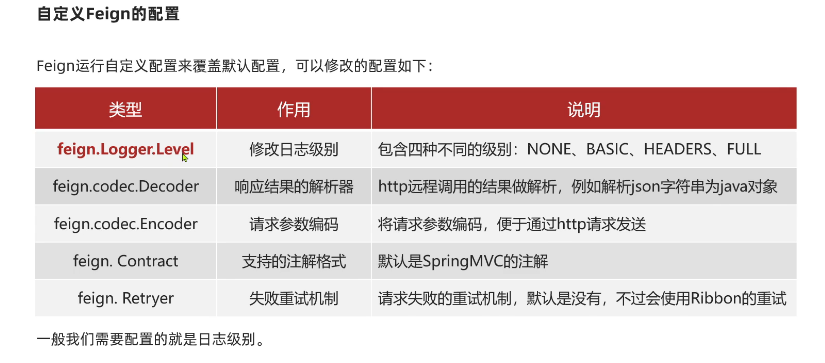

配置Feign日志的两种方式:

方式一: 配置文件方式
- 全局配置
```yaml
feign:
  client:
    config:
      default:
        logger-level: full
```
- 局部生效
```yaml
feign:
  client:
    config:
      userservice:
        logger-level: full
```
方式二: java代码方式, 需要声明一个Bean:
```java
public class DefaultFeignConfiguration {
    @Bean
    public Logger.Level logLevel() {
        return Logger.Level.BASIC;
    }
}
```
- 全局配置
```
@EnableFeignClients(defaultConfiguration = DefaultFeignConfiguration.class)
```
- 局部生效
```
@FeignClient(value = "userservice", configuration = DefaultFeignConfiguration.class)
```
### 3. Feign使用优化
Feign底层的客户端实现:
- URLConnection: 默认实现, 不支持连接池
- Apache HttpClient: 支持连接池
- OKHttp: 支持连接池

因此优化Feign的性能主要包括:
- 使用连接池代替默认的URLConnection
- 日志级别, 最好用basic或none

Feign添加HttpClient的支持

引入依赖:
```xml
        <!--httpClient依赖-->
        <dependency>
            <groupId>io.github.openfeign</groupId>
            <artifactId>feign-httpclient</artifactId>
        </dependency>
```

yaml配置文件
```yaml
feign:
  httpclient:
    enabled: true # 支持httpClient的开关
    max-connections: 200 # 最大连接数
    max-connections-per-route: 50 # 单个路径的最大连接数
```

### 4. 最佳实践
#### (1). 方式一(继承): 

给消费者的FeignClient和提供者的controller定义统一的父接口作为标准

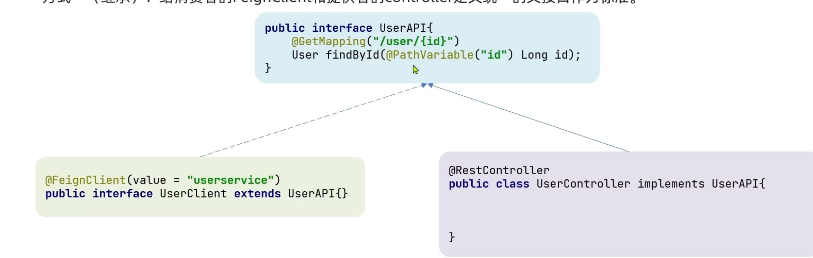

缺点: 
- 服务紧耦合
- 父接口参数列表中的映射不会被继承
### (2). 方式二(抽取): 

将FeignClient抽取为独立模块, 并且把接口有关的POJO, 默认的Feign配置都放到这个模块中, 
提供给所有消费者使用

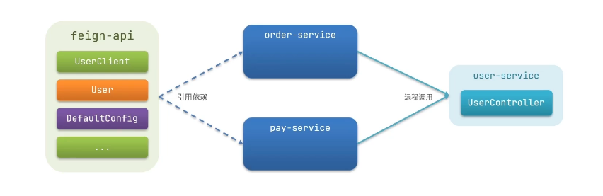

缺点:
- 功能过多, 显得冗杂

实现过程:
- 首先创建一个module, 命名为feign-api, 然后引入feign的starter依赖
- 将order-service中编写的UserClient, User, DefaultFeignConfiguration都复制到Feign-api项目中
- 在order-service中引入feign-api的依赖
- 修改order-service中的所有与上述三个组件有关的import部分, 改成导入feign-api中的包

不同包的FeignClient的导入方式有两种方式:
- 在@EanbleFeignClients注解中添加basePackages, 指定FeignClient所在的包
- 在@EanbleFeignClients注解中添加clients, 指定具体的FeignClient字节码

## 八. GateWay网关组件
### (1). 为什么需要网关
- 网关功能: 
  - 身份认证和权限效验
  - 服务路由, 负载均衡
  - 请求限流
- 网关技术实现(SpringCloud网关的实现两种):
  - gateway
  - zuul
zuul是基于Servlet的实现, 属于阻塞式编程, 而SpringCloudGateway则是基于Spring5中提供的WebFlux, 
属于响应式编程的实现, 具备更好的性能

### (2). 搭建网关服务
搭建网关服务的步骤: 
1. 创建新module, 引入SpringCloudGateway的依赖和nacos的服务注册发现依赖:
   ```xml
   <!--nacos服务注册发现依赖-->
   <dependency>
       <groupId>com.alibaba.cloud</groupId>
       <artifactId>spring-cloud-starter-alibaba-nacos-discovery</artifactId>
   </dependency>
   
   <!--网关gateway依赖-->
   <dependency>
       <groupId>org.springframework.cloud</groupId>
       <artifactId>spring-cloud-starter-gateway</artifactId>
   </dependency>
   ```

2. 实现请求路由功能(编写路由配置及nacos地址):
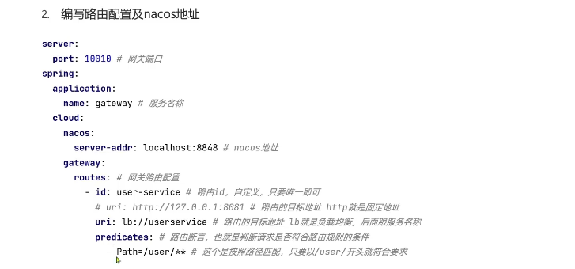

   ```yaml
   server:
     port: 10010
   spring:
     application:
       name: gateway
     cloud:
       nacos:
         server-addr: localhost:80 # nacos地址
         discovery:
           namespace: uuid
       gateway:
         routes:
           - id: user-service # 路由标识, 必须唯一
             uri: lb://userservice #路由的目标地址
             predicates: # 路由断言, 判断请求是否符合规则
               - Path=/user/** # 路径断言, 判断路径是否符合是以/user开头, 如果是则符合
           - id: order-service
             uri: lb://orders*ervice
             predicates:
               - Path=/order/**
   ```
   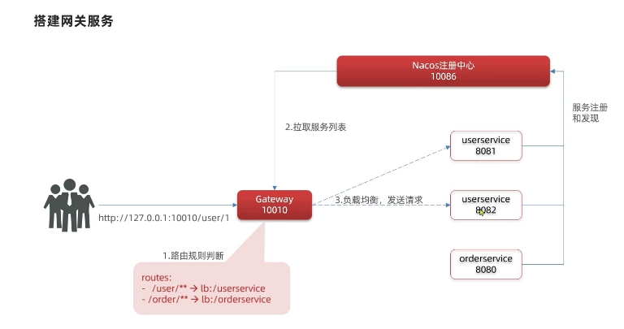

3. 路由断言工厂5
   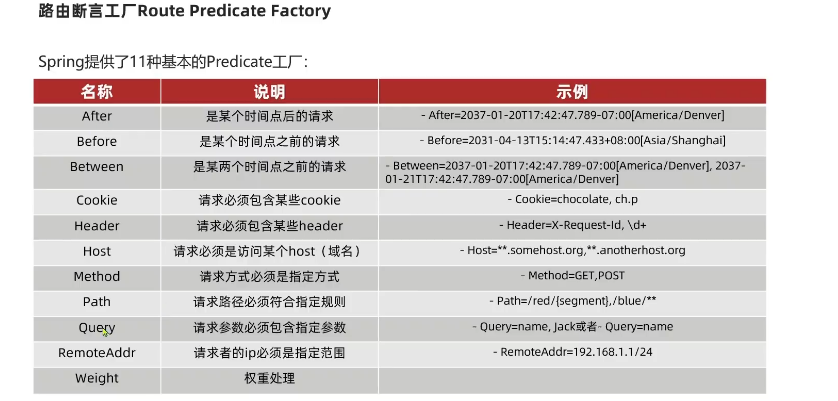
4. 路由过滤器GatewayFilter
   - 网关中提供的一种过滤器, 可以对象那个进入网关的请求和微服务返回的响应做处理

      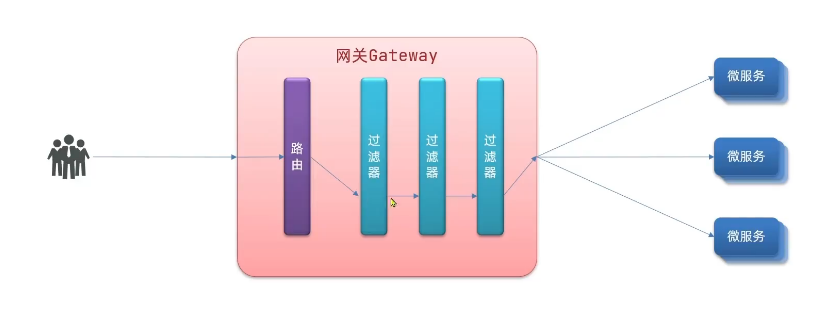
   - Spring提供的过滤器工厂

      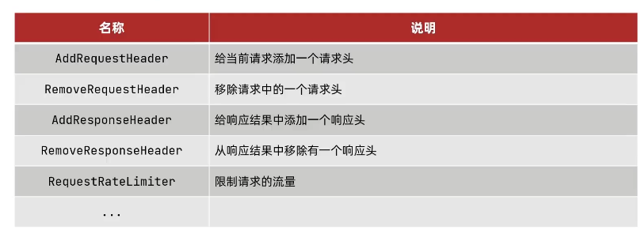

   - 给所有进入userservice的请求添加一个请求头: Truth=itstudy is my workspace 
   给配置文件直接加个过滤器配置
   ```yaml
   spring:
     application:
       name: gateway
     cloud:
       gateway:
         routes:
           filters:
             - AddRequestHeader=Truth,itstudy is my workspace
   ```
   - 所有服务的请求都加上一个请求头
   ```yaml
   spring:
     application:
       name: gateway
     cloud:
       gateway:
         routes:
         default-filters:  # 与routes同级
           - AddRequestHeader=Truth,itstudy is my workspace
   ```
5. 全局过滤器 GlobalFilter

   与GatewayFilter的作用一样, 区别在于GateFilter通过配置定义, 处理逻辑是固定的, 而GlobalFilter的逻辑需要自己写代码实现
   
   定义方式是实现GlobalFilter接口
   
   案例: 定义全局过滤器, 拦截请求, 判断请求的参数是否满足下列要求:
   
   ```java
   /**
    * className AuthorizeFilter
    * packageName cn.itcast.gateway
    * Description AuthorizeFilter全局过滤器
    * # @Order(-1) 拦截器的优先级
    * @author huian
    * @version 1.0
    * @Date: 2023/8/10 11:31
    */
   /*@Order(-1)*/
   @Component
   public class AuthorizeFilter implements GlobalFilter, Ordered {
   
       /**
        * Description: 定义全局过滤器, 拦截请求, 判断请求的参数是否满足下列要求:
        * 1. 参数中是否有authorization
        * 2. authorization参数值是否为admin
        * 3. 如果同时满足则放行, 否则拦截
        * @return reactor.core.publisher.Mono<java.lang.Void> 返回标示当前过滤器业务结束
        * @param exchange 请求上下文, 里面可以获取Request, Response等信息
        * @param chain 用来把请求委托给下一个过滤器
        * @author huian
        * @Date 2023/8/10
        * */
       @Override
       public Mono<Void> filter(ServerWebExchange exchange, GatewayFilterChain chain) {
           /*1. 获取请求参数*/
           ServerHttpRequest request = exchange.getRequest();
           MultiValueMap<String, String> queryParams = request.getQueryParams();
           /*2. 获取参数中的authorization参数*/
           String auth = queryParams.getFirst("authorization");
           /*3. 判断参数值是否等于admin*/
           if ("admin".equals(auth)) {
               /*4. 是, 放行*/
               return chain.filter(exchange);
           }
           /*5. 否, 拦截*/
           /*5.1. 设置状态码*/
           exchange.getResponse().setStatusCode(HttpStatus.NOT_FOUND);
           /*5.2. 返回拦截状态*/
           return exchange.getResponse().setComplete();
       }
   
       /**
        * Description: getOrder与@Order(-1)同样的作用, 设置拦截器的优先级
        * @return int
        * @author huian
        * @Date 2023/8/10
        * */
       @Override
       public int getOrder() {
           return -1;
       }
   }
   ```
   只有访问这个链接时加上authorization=admin才能成功: `http://localhost:10010/user/1?authorization=admin`

6. 过滤器执行顺序

请求进入网关后会碰到三类过滤器: 当前路由的过滤器, DefaultFilter, GlobalFilter

请求路由后, 会将当前路由过滤器和DefaultFilter, GlobalFilter, 合并到过滤器链(集合)中, 排序后依次执行每个过滤器
- 每一个过滤器都必须制定一个int类型的order值, **order值越小, 优先级越高, 执行顺序越靠前**
- GlobalFilter通过实现Order接口, 或者添加@Ordered接口来指定Order值, 有我们自己制定
- 路由过滤器和defaultFilter的order由Spring制定, 默认是按照声明顺序从1递增
- 当过滤器的order值一样时, 会按照 defaultFilter > 路由过滤器 > GlobalFilter的顺序来执行

### (3). 跨域问题处理
跨域: 域名不一致就是跨域, 主要包括:
- 域名不同: www.taobao.com 和 www.taobao.org 和 www.jd.com 和 miaosha.jd.com
- 域名相同, 端口不同: localhost:8080 和 localhost:8081

跨域问题: 游览器禁止请求的发起者与服务端发生跨域ajax请求, 请求被游览器拦截的问题

解决方案: CORS

网关处理跨域同样采用CORS方案, 只需如下配置:
```yaml
spring:
  gateway:
    globalcors: # 全局的跨域处理
      add-to-simple-url-handler-mapping: true # 解决options请求被拦截问题
      corsConfigurations:
        '[/**]':
          allowedOrigins: # 允许哪些网站的跨域请求
            - "http://localhost:5500"
            - "http://www.leyou.com"
          allowedMethods: # 允许的跨域ajax的请求方式
            - "GET"
            - "POST"
            - "DELETE"
            - "PUT"
            - "OPTIONS"
          allowedHeaders: "*" # 允许在请求中携带的头信息
          allowCredentials: true # 是否允许携带cookie
          maxAge: 360000 # 这次跨域检测的有效期360000秒
```

## 九. MQ异步通信技术
### 


