<!-- TOC -->
  * [微服务保护](#微服务保护)
    * [一. 初识Sentinel](#一-初识sentinel)
      * [(1). 雪崩问题及解决方案](#1-雪崩问题及解决方案)
      * [(2). 服务保护技术对比](#2-服务保护技术对比)
      * [(3). Sentinel介绍和安装](#3-sentinel介绍和安装)
      * [(4). 微服务整合Sentinel](#4-微服务整合sentinel)
    * [二. 限流规则](#二-限流规则)
      * [(1). 簇点链路](#1-簇点链路)
      * [(2). 流控模式](#2-流控模式)
        * [A. 直接模式](#a-直接模式)
        * [B. 关联模式](#b-关联模式)
        * [C. 链路模式](#c-链路模式)
      * [(3). 流控效果](#3-流控效果)
        * [A. warm up](#a-warm-up)
      * [B. 排队等待](#b-排队等待)
      * [(4). 热点参数限流](#4-热点参数限流)
    * [三. 隔离和降级](#三-隔离和降级)
      * [(1). FeignClient整合Sentinel](#1-feignclient整合sentinel)
      * [(2). 线程隔离(舱壁模式)](#2-线程隔离舱壁模式)
      * [(3). 熔断降级](#3-熔断降级)
    * [四. 授权规则](#四-授权规则)
      * [(1). 授权规则](#1-授权规则)
      * [(2). 自定义异常结果](#2-自定义异常结果)
    * [五. 规则持久化](#五-规则持久化)
      * [(1). 规则管理模式](#1-规则管理模式)
<!-- TOC -->

## 微服务保护

### 一. 初识Sentinel

#### (1). 雪崩问题及解决方案

**微服务调用链路中的某个服务故障, 引起整个链路中的所有微服务都不可用, 这就是雪崩**

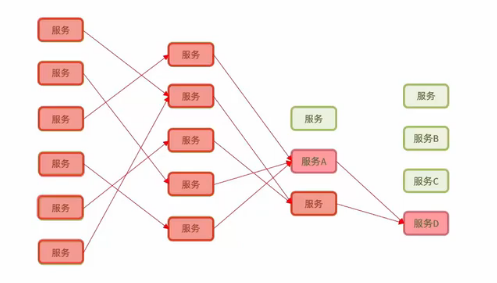
解决雪崩问题的常见方式有四种: 

- 超时处理: 设定超时时间, 请求超过一定时间没有响应就返回错误信息, 不会无休止等待
- 舱壁模式: 限定每个业务能使用的线程数, 避免耗尽整个tomcat的资源, 因此也叫做线程隔离
- 熔断降级: 由**断路器**统计业务执行的异常比例, 如果超出阈值则会熔断该业务, 拦截访问该业务的一切请求.
- 流量控制: 限制业务访问的QPS, 避免服务因瞬间高并发流量的而导致服务故障

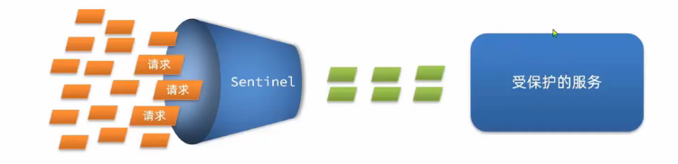

#### (2). 服务保护技术对比

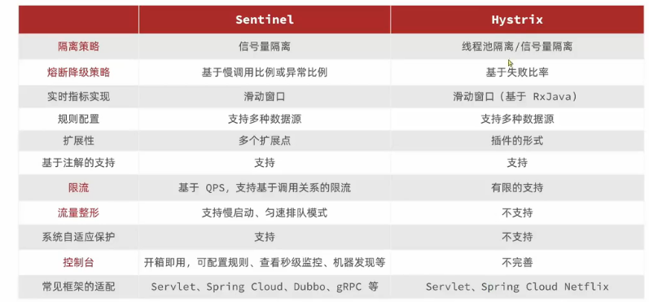

#### (3). Sentinel介绍和安装

>[sentinel官方介绍](https://github.com/alibaba/Sentinel/wiki/%E4%B8%BB%E9%A1%B5)

#### (4). 微服务整合Sentinel
1. 引入sentinel依赖: 
    ```xml
   <dependency>
      <groupId>com.alibaba.cloud</groupId>
      <artifactId>spring-cloud-starter-alibaba-sentinel</artifactId>
   </dependency>
    ```
2. 配置控制台地址: 
   ```yaml
     sentinel:
       transport:
         dashboard: localhost:10086 # sentinel控制台地址
   ```
3. 访问微服务的任意端点, 出发sentinel监控: 
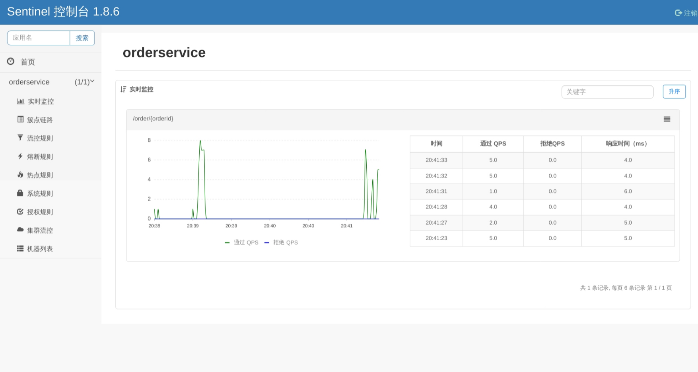

### 二. 限流规则
#### (1). 簇点链路
簇点链路: 就是项目内的调用链路, 链路中被监控的每个接口就是一个资源. 默认情况下sentinel会监控SpringMVC的
每一个端点(Endpoint), 因此SpringMVC的每一个端点(Endpoint)就是调用链路中的一个资源.

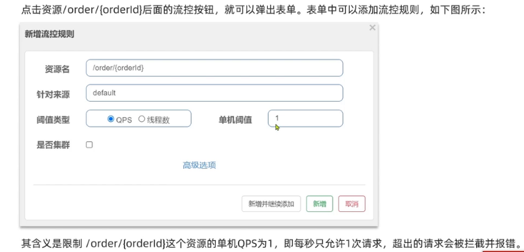

给orderservice加上sentinel的限流规则

#### (2). 流控模式
##### A. 直接模式

##### B. 关联模式
  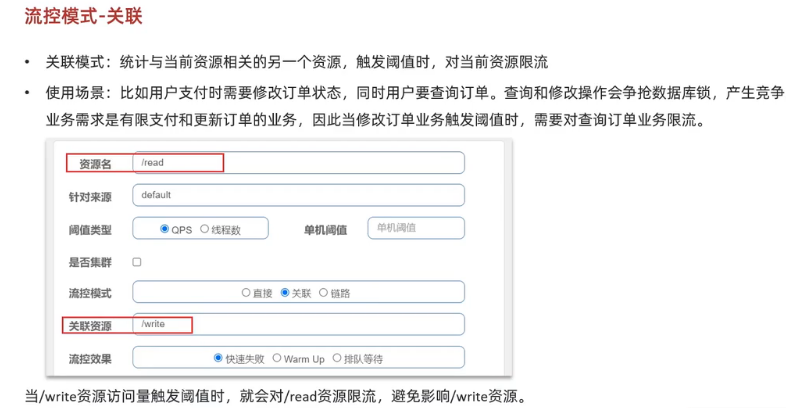

满足下面条件可以使用观念模式：
- 两个有竞争关系的资源
- 一个优先级较高， 一个优先级较低

##### C. 链路模式
  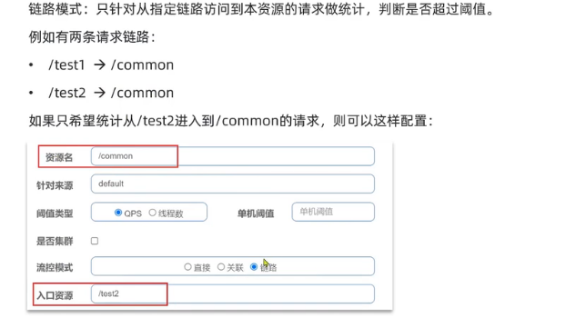
- Sentinel默认只标记Controller中的方法为资源, 如果要标记其他方法, 需要利用@SentinelResource注解

- Sentinel默认会将Controller方法做context整合, 导致链路模式的流控失效, 需要修改application.yml, 添加配置
```yaml
spring:
  sentinel:
    web-context-unify: false # 关闭context整合
```
**流控模式的分类**
- 直接: 对当前资源限流
- 关联: 高优先级资源触发阈值, 对低优先级资源限流
- 链路: 阈值统计时, 只统计从指定资源进入当前资源的请求, 是对请求来源的限流

#### (3). 流控效果
流控效果是指请求达到流控阈值时应该采取的措施, 包括三种:
- 快速失败: 达到阈值后, 新的请求会被立即拒绝并且抛出FlowException异常, 是默认的处理方式
- warm up: 预热模式, 对超出阈值的请求同样是拒绝并且抛出异常, 但这种模式阈值会动态变化, 从一个较小值逐渐增加到最大阈值
- 排队等待: 让所有的请求按照先后次序排队执行, 两个请求的间隔不能小于指定时长, 如果请求预期等待时长大于超时时间, 直接拒绝

##### A. warm up
预热模式, 是应对服务冷启动的一种方案, 请求阈值初始值是 threshold / coldFactor, 持续指定时长后, 逐渐提高到threshold值, 而coldFactor的默认值是3

#### B. 排队等待
当请求超过QPS阈值时, 快速失败和warm up会拒绝新的请求并抛出异常, 而排队等待则是让所有请求进入一个队列中, 然后按照阈值允许的时间间隔依次执行, 后来的请求必须等待前面执行完成, 如果请求预期的等待时间超出最大时长, 则会被拒绝.

#### (4). 热点参数限流
分别统计参数值相同的请求, 判断是否超过QPS阈值
  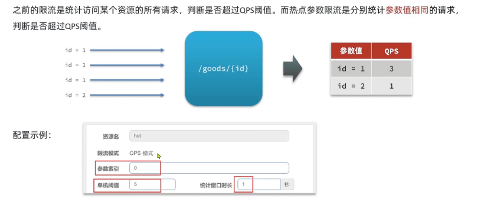

对hot这个资源的0号参数(第一个参数)做统计, 每1秒相同参数值的请求数不能超过5

**注意:** 热点参数限流对默认的SpringMVC资源无效

### 三. 隔离和降级
#### (1). FeignClient整合Sentinel
虽然限流可以尽量避免因高并发而引起的服务故障, 但服务还会因为其他原因而故障, 而要将这些故障控制在一定范围, 避免雪崩, 就要靠线程隔离(舱壁模式)和熔断降级手段了.
不管是线程隔离还是熔断降级, 都是对客户端(调用方)的保护.
  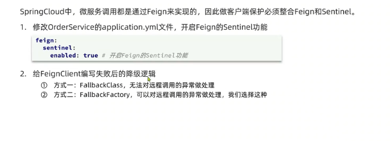

Sentinel支持的雪崩解决方案:
- 线程隔离 (舱壁模式)
- 降级熔断

Feign整合Sentinel的步骤:
- 在application.yml中配置: feign.sentinel.enable=true
- 给FeignClient编写FallbackFactory并注册为Bean
- 将FallbackFactory配置到FeignClient

#### (2). 线程隔离(舱壁模式)
两种实现方式:
- 线程池隔离
  - 优点: 支持主动超时, 支持异步调用
  - 缺点: 线程的额外开销比较大
  - 场景: 底扇出
- 信号量隔离(Sentinel默认采用)
  - 优点: 轻量级, 无额外开销
  - 缺点: 不支持主动超时, 不支持异步调用
  - 场景: 高频调用, 高扇出
    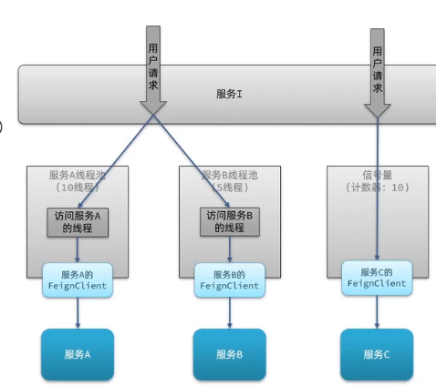

添加限流规则时, 可以选择两种阈值类型: 
- QPS: 就是每秒的请求数
- 线程数: 是该资源能使用的tomcat线程数的最大值, 也就是通过限制线程数量, 实现舱壁模式

#### (3). 熔断降级
熔断降级是解决雪崩问题的重要手段, 其思路是有路由器统计服务调用的异常比例, 慢请求比例, 如果超出阈值则会熔断该服务. 即拦截访问该服务的一切请求; 而当服务恢复时, 断路器会放行访问该服务的请求

**断路器的三大状态**

  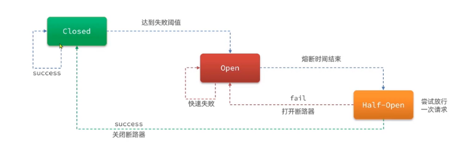

**断路器的三种熔断策略: 慢调用, 异常比例, 异常数**
- 慢调用: 业务的响应时长(RT)大于指定时长的请求认定为慢调用请求, 在指定时间内, 如果请求数量超过设定的最小数量, 慢调用比例大于设定的阈值, 则触发熔断

  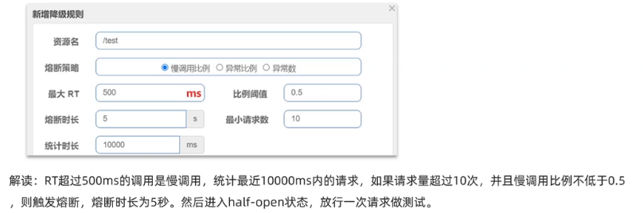

- 异常比例或异常数: 统计指定时间内的调用, 如果调用次数超过指定请求数, 并且出现异常的比例达到设定的比例阈值(或超过指定异常数), 则触发熔断

  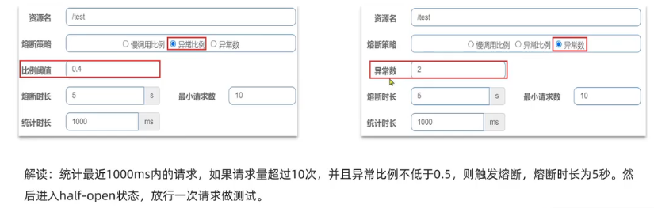

### 四. 授权规则
#### (1). 授权规则
授权规则可以对调用方的来源做控制, 有白名单和黑名单两种方式
- 白名单: 来源(origin) 在白名单内的调用者允许访问
- 黑名单: 来源(origin) 在黑名单内的调用者不允许访问

例如: 限定只允许从网关来的请求访问order-service, 那么流控应用中就填写网关的名称

Sentinel是通过RequestOriginParser这个接口的parseOrigin来获取请求的来源的

需要在gateway服务中, 利用网关的过滤器添加名为gateway的origin头: 
```yaml
spring:
  cloud:
    gateway:
      default-filters:
        - AddRequestHeader=origin,gateway # 添加名为origin的请求头, 值为gateway
```
白名单为值: gateway, 黑名单值: 空

#### (2). 自定义异常结果
默认情况下, 发生限流, 降级, 授权拦截时, 都会抛出异常到调用方, 如果要定义异常时的返回结果, 需要实现BlockExceptionHandler接口:

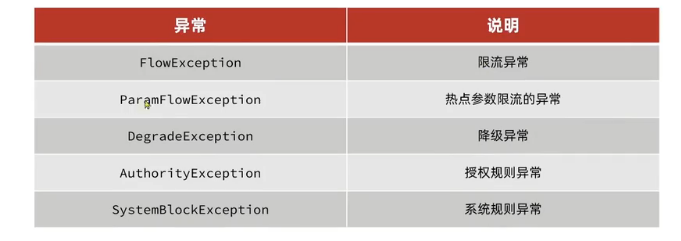

示例: 
```java
@Component
public class SentinelExceptionHandler implements BlockExceptionHandler {
    @Override
    public void handle(HttpServletRequest httpServletRequest, HttpServletResponse httpServletResponse, BlockException e) throws Exception {
        String msg = "未知异常";
        int status = 429;
        if (e instanceof FlowException) {
            msg = "请求被限流了";
        } else if (e instanceof ParamFlowException) {
            msg = "请求被热点参数限流了";
        } else if (e instanceof DegradeException) {
            msg = "没有权限访问";
            status = 401;
        }

        httpServletResponse.setContentType("application/json;charset=utf-8");
        httpServletResponse.setStatus(status);
        httpServletResponse.getWriter().println("{\"msg\": " + msg + ", \"status\":" + status + "}");
    }
}

```

### 五. 规则持久化
#### (1). 规则管理模式
- 原始模式: Sentinel的默认模式, 将规则保存在内存, 重启服务会丢失
- pull模式: 控制台将配置的规则推送到Sentinel客户端, 而客户端会将配置规则保存在本地文件或数据库中, 以后会定时去本地文件或数据库中查询, 更新本地规则
 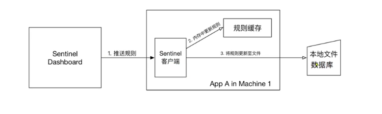
  
  缺点: 时效性问题

- push模式: 控制台将配置规则推送到远程配置中心, 例如Nacos. Sentinel客户端监听Nacos, 获取配置变更的推送消息, 完成本地配置更新.实时更新

  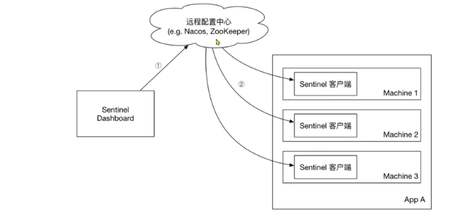

push模式实现最为ie复杂, 依赖于nacos, 并且需要修改Sentinel控制台源码


